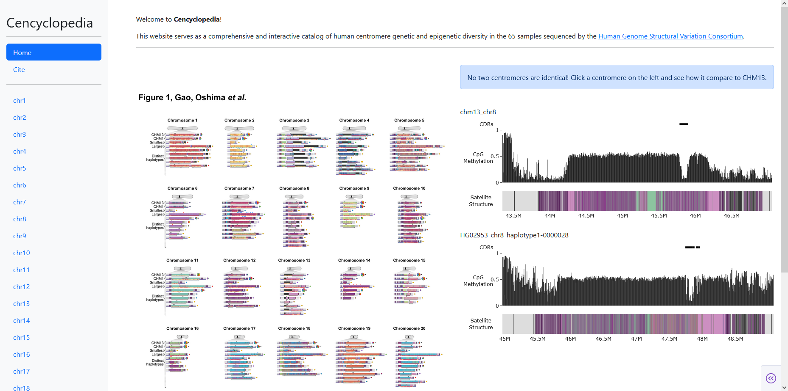

# Cencyclopedia
Interactive centromere catalog.

<table>
  <tr>
    <td>
      <figure>
        
        <br>
        <figcaption>Centromere haplotypes</figcaption>
      </figure>
    </td>
    <td>
      <figure>
        
        <br>
        <figcaption>Phylogenetic tree</figcaption>
      </figure>
    </td>
  </tr>
</table>

## Getting Started
Setup dependencies. Requires Python >= 3.12.
```bash
python -m venv venv
source venv/bin/activate
python -m pip install -r requirements.txt
```


## Run locally
### Python
Set up app locally. Data is stored in repo.
```bash
python -m cencyclopedia.app
```

Then, open `127.0.0.1:8050` in browser:

### Docker
> WIP
