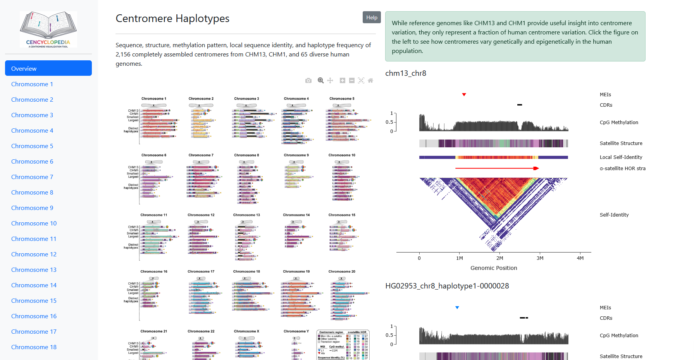
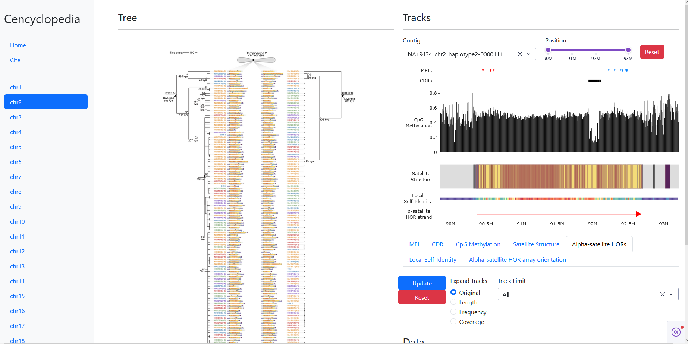
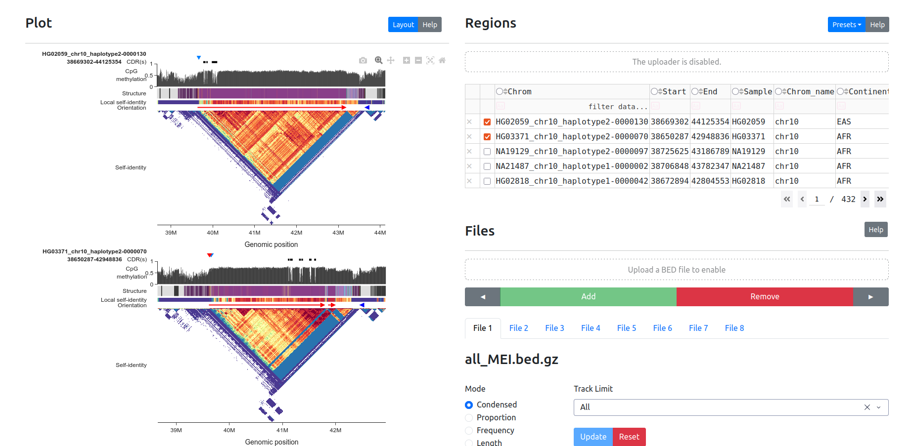
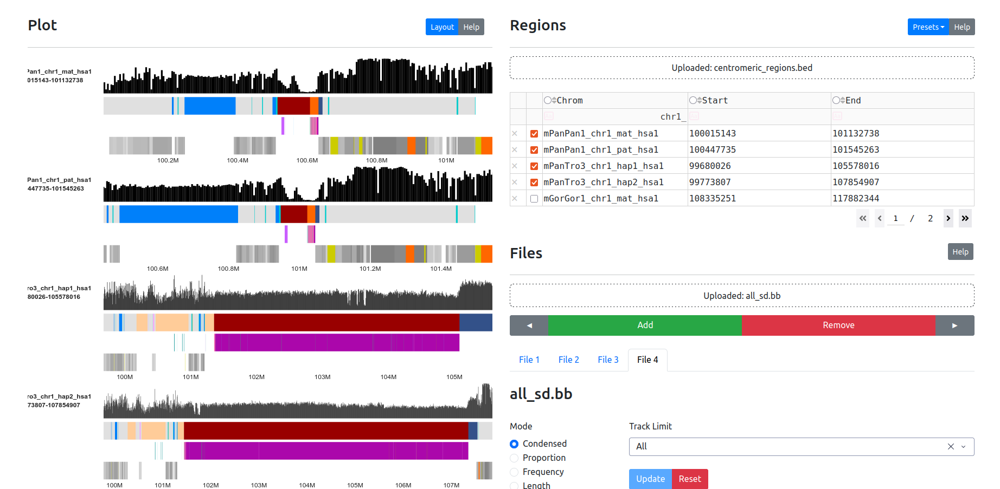

# Cencyclopedia
Interactive centromere catalog.

<table>
  <tr>
    <td>
      <figure>
        
        <br>
        <figcaption>HGSVC centromere haplotypes</figcaption>
      </figure>
    </td>
    <td>
      <figure>
        
        <br>
        <figcaption>HGSVC phylogenetic tree</figcaption>
      </figure>
    </td>
  </tr>
  <tr>
     <td>
      <figure>
        
        <br>
        <figcaption>Load preset data</figcaption>
      </figure>
    </td>
       <td>
      <figure>
        
        <br>
        <figcaption>Upload and visualize custom data</figcaption>
      </figure>
    </td>
  </tr>
</table>

## Getting Started
Clone repo.
```bash
git clone git@github.com:logsdon-lab/Cencyclopedia.git
cd Cencyclopedia
```

Setup dependencies using `pixi`.
```bash
pixi install
```

## Browser
View in your browser at https://cencyclopedia.com.

## Run locally
### Python
Set up app locally. Data is stored in repo.
```bash
pixi run local
```

Then, open [`127.0.0.1:8050`](http://127.0.0.1:8050) in browser.

#### Data viewer only
To view just the centromere and dataviewer, create a copy of the config file.
```bash
cp config.yaml config_single.yaml
```

Modify `general.mode`, `general.output_regions`, and `general.selected_cen.height`.
```yaml
general:
  mode: single
  output_regions: data/hgsvc/bed_single.csv.gz
  selected_cen:
    height: 800
    vertical_spacing: 0.0
```

Then rerun pointing to the new configfile.
```bash
export CENCYCLOPEDIA_CONFIG="config_single.yaml"
pixi run local
```

### Docker
Build the container and run app exposed on port 8050.
```bash
docker build -t cencyclopedia:latest .
docker run -p 8050:8050 --rm cencyclopedia:latest
```

Then, open [`127.0.0.1:8050`](http://127.0.0.1:8050) in browser.

## TODO
* [ ] More scalable data storage solution probably with AWS support.

## Cite
Gao, S., Oshima, K.K., Chuang, SC. et al. A global view of human centromere variation and evolution. Nature (2026). https://doi.org/10.1038/s41586-026-10841-9
